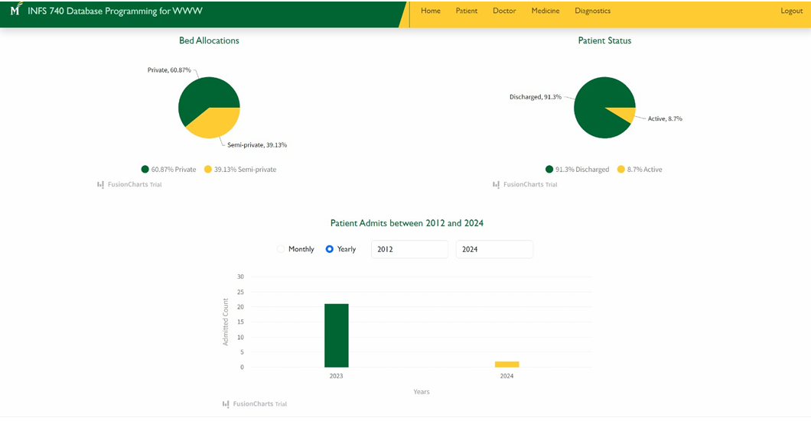
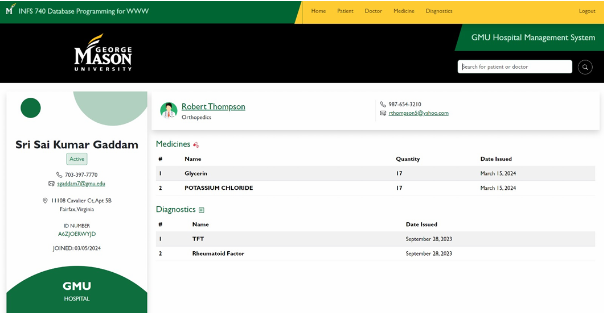

# Hospital Management System

Frontend Code - https://github.com/Srisai27/HMS-front-end-angular

### Introduction
The Hospital management system is a comprehensive platform designed to streamline and 
optimize healthcare operations, from patient care to administrative tasks. Built using Angular 
for the frontend, Django for backend functionality, and MongoDB for data storage. It includes 
features such as patient records management, inventory control, billing, and analytics, 
empowering healthcare providers to deliver efficient, high-quality care while improving 
overall organizational productivity and patient outcomes.

### Technologies Used 
1) Django
2) MongoDB 
3) RESTful Web Services
- Frontend (Code in another repository mentioned above)
1) Angular 
2) Auth0 – Third Party Authentication Service
3) Bootstrap 
4) HTML 
5) CSS 

### Sample UI:

#### Home page

#### Patient page

### Instructions to work on a Django project in pycharm
To create project
- django-admin startproject project_name . 
- "." at end tells to start project at current directory

To create an app in Django project
- django-admin startapp app_name

To run app (two ways)
1) python manage.py runserver (or)
2) In run --> Edit config --> Add config 
    - path: project_name/manage.py
    - parameters: runserver

Everytime we create an app, needs to add it in "INSTALLED_APPS" variable
in settings.py file

When Building APIs in Django, we don't need "sessions" app so we can delete
it from settings.py file

We need to map our urls to functions so that each url redirects to specific target (Internal app mappings)
- So add "urls.py" file in app folder and configure
- ex: urlpatterns = [path('hello', views.say_hello)] - here say_hello is method name and 
views is file name that contains the method

Next, we need to configure URL path in main urls.py (present in project folder) (External app mappings)
- ex: urlpatterns = [path('app_name/', include('app_name.urls')]
